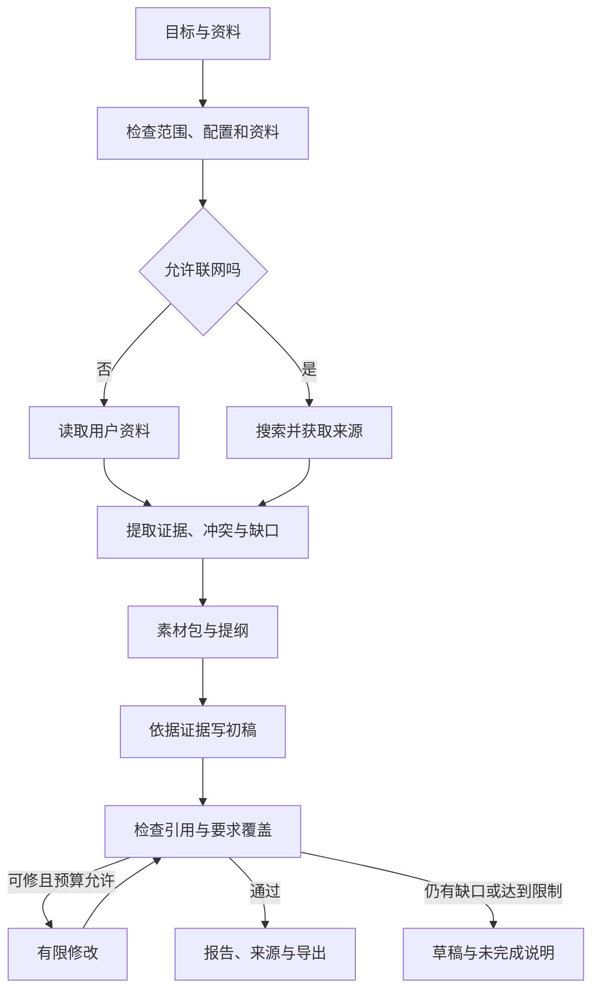

# 资料整理与研究写作助手：实用化优化计划

- 编写日期：2026-09-07。
- 用户已确认的首个场景：**资料整理与研究写作**。
- 改造范围：仅 `agent-mvp/`，不改 DSH 本体、插件仓库、用户全局配置。
- 文档状态：**实施中，B1与B2已通过离线验收**。下文其他新接口、数据结构和业务指标仍为目标，不表示已经完成。
- 初始基线148项；B1后174项，B2后199项离线测试通过。业务案例已定义20项，故障案例10项，均未执行业务验收；真实模型业务质量尚未验收。详见`RESEARCH_WRITING_ACCEPTANCE.md`与`EXECUTION_STATUS.md`。
- 旧计划的定位：01～130 步保留为组件学习记录；实用化开发优先按本文推进，完成与否以业务验收为准。

## 1. 产品定位与第一版边界

### 1.1 产品目标

做一个在本机运行的个人研究写作助手：用户导入资料、提供网页链接或提出研究主题，系统收集并整理证据，生成带来源的报告，支持按反馈修改、保存和导出。

第一版默认单用户、本机访问、一个受控后台任务队列。模型可使用用户配置的远端服务；应用在本机运行不代表资料不会发送给模型，界面必须清楚显示实际模型与资料发送范围。

### 1.2 必须完成的三类工作

| 工作类型 | 用户输入示例 | 必须交付的结果 |
|---|---|---|
| 已有资料整理 | “整理这 5 份材料，列出结论、证据、重复内容与矛盾点。” | 素材包、来源清单、冲突与缺口；证据可定位原文 |
| 主题研究写作 | “研究这个主题的几个关键问题，写一份有来源的报告。” | 明确研究范围、实际获取的材料、事实与推断分开的正文、引用与局限 |
| 基于原稿修改 | “保留引用，缩短报告，并补充第三节的反方观点。” | 新版本、变更说明、更新后的引用；旧版本可查看 |

“仅依据提供资料”模式不得自行联网补充事实。“允许联网研究”模式才搜索和获取新材料。资料不足时交付缺口，不能悄悄改成无来源的自由写作。

### 1.3 首版输入、输出与规模

- 首批输入：粘贴文本、TXT、Markdown、用户指定的 HTTP(S) 链接，以及一套明确配置的搜索服务。
- 文本型 PDF 在基础资料链路验收后单独加入；扫描件/OCR、复杂表格、DOCX 输入不阻塞第一批交付。不支持的格式提前说明。
- 输出：`report.md`、安全的 HTML 预览/下载、`sources.json`、`evidence.json`、`review.json`；DOCX 导出后续增加。
- 建议初始限制：单任务最多 20 个来源；单来源提取文本最多 2 MB，总提取文本最多 10 MB；原始下载另设大小上限。超过限制明确拒绝或提示缩小范围，不静默截断。
- 默认一个根任务执行、少量有界排队；研究阶段先串行。只有验证确有收益后才放开 2～3 个并行分支。
- 上述规模是拟定的产品约束，可根据真实样本调整，不是当前测出的性能上限。

### 1.4 暂不做什么

- 不同时建设编程助手、自动发邮件、自动发布或任意系统命令代理。
- 不以增加 Debate、Dynamic Team 等编排名称作为交付目标。
- 不先引入向量数据库、分布式队列、微服务或云端多租户。
- 不自动学习所有用户资料，不默认保存跨任务长期记忆。
- 不复刻整个 legacy 前端，不批量迁移未经核实的旧工具。
- 不用测试数量、回答长度或角色数量代替产品验收。

## 2. 当前代码与实际产品之间的差距

下表保存立项时的问题依据，部分已在B1/B2解决；当前逐项状态以IMPLEMENTATION_TRACKER.md为准，完成证据按步骤追加在IMPLEMENTATION_LOG.md。

| 当前差距 | 代码依据 | 实际影响 | 阶段 |
|---|---|---|---|
| 真实模式入口不明确 | Web 按钮强制 Mock；factory 无 Key 会回退 Mock | 用户可能误以为正在做真实研究 | S1 |
| 模型配置覆盖关系不可靠 | factory 用内置 profile 覆盖 model；provider、能力与价格未形成完整配置契约 | 换模型后实际请求和预期可能不同 | S1 |
| 默认无资料获取工具 | Registry 只有 calculator/current_time | 研究员提示词不能产生搜索与阅读能力 | S2 |
| 流水线丢失素材 | pipeline 的 writer 分支重写 task_text，未传上一棒产物；pack_card 只取前 400 字 | Writer 可能没看到实际材料 | S3 |
| 依赖顺序不等于依赖数据传递 | manager_worker/default runner 主要传任务描述 | 任务按顺序跑了，但后一步缺前一步结果 | S3 |
| 角色配置主要停留在声明 | make_worker 主要注入 prompt | tools/skills/model_profile/permissions 未完整生效 | S3 |
| 计划校验不足 | 缺少完整 DAG、循环依赖与重规划后引用校验；未知依赖可能被忽略 | 错误就绪、卡住或错误标记完成 | S3/S4 |
| 上下文/技能/记忆未统一接入 | 主 Runtime 未逐次调用完整上下文组装和会话加载 | 长资料容易丢失，追问不能可靠继承 | S3/S4 |
| 成本有盲区 | Planner、Replanner、Judge、Rerank 等直接调用 llm.chat | 单 run 用量不等于整个用户任务成本 | S1/S4 |
| 恢复与业务未接通 | durable 是独立接口，Checkpointer 当前是内存版 | 重启后不能可靠继续业务任务 | S4 |
| 审批只在当前进程有效 | pending 在 Web 内存 | 重启丢失待审批状态 | S4 |
| 幂等记录不等于 exactly-once | ExecutionLedger 在动作完成后才保存结果 | 动作成功、记录失败时可能重复执行 | S4 |
| 页面仍偏日志展示 | 缺资料、引用、版本和改稿流程 | 用户必须理解内部细节才能操作 | S5 |
| 真实评测入口失真 | benchmark 的 --no-skip 仅取消跳过，内部仍构造 MockLLM | 不能据此宣称已完成真实模型验收 | S0/S6 |
| 质量评估过弱 | e2e 主要检查子串/正则 | 编造引用、漏材料仍可能通过 | S0/S6 |

## 3. 用户完整操作流程

### 3.1 创建任务

用户填写目标、用途/读者、期望长度，选择资料模式，添加文件与链接。提交前可见实际模型、预算、支持格式，以及哪些材料会发送给模型。

系统检查资料可读性、配置与工具。只有关键业务条件不明时才追问，例如“比较哪两个对象”；普通表达偏好采用可见默认值。

### 3.2 获取、写作与交付



进度使用业务语言，例如“已读取 4/5 份资料”“正在检查第三节引用”。内部节点、Trace 和诊断信息放在详情中。

### 3.3 修改与继续

同一任务的后续要求加载原目标、来源、报告版本和修改历史，优先复用已有材料。用户要求更新、提出新问题或来源失效时才补取资料。

新稿保存父版本、变更原因和所用来源版本，不覆盖旧稿。刷新页面能继续查看；服务重启后能读到历史，并按恢复规则处理未完成任务。

## 4. 目标架构与数据契约

### 4.1 保留现有框架，新增一个业务入口

保留 Python、LangGraph、Tool Registry、Runtime 与 Workbench。拟新增 `src/application/research.py` 装配研究写作流程，Web、CLI 和评测都调用它；不要各自拼一套逻辑。

来源、证据和产物模块按实际需要新增小文件，不为了凑架构预建空服务层，也不重写 LangGraph 的图执行机制。

### 4.2 分清数据对象

| 对象 | 含义 | 关键字段/约束 |
|---|---|---|
| Session | 围绕同一项目的持续讨论 | session_id、目标、历史和报告引用；默认不跨会话共享资料 |
| Job | 用户一次提交或一次改稿请求 | job_id、session_id、模式、预算、状态、当前阶段、final_artifact_id |
| Run | 一个 Agent/阶段的执行 | run_id、root_job_id、parent_run_id、角色、实际模型、用量 |
| PlanTask | 计划执行单元 | task_id、depends_on、input/output_artifact_ids、状态、尝试次数 |
| Source | 实际获取或导入的资料 | source_id、地址/文件名、标题、获取时间、正文快照、内容哈希、解析状态 |
| Evidence | 可定位的原文证据 | evidence_id、source_id、摘录、页码/段落/偏移、支持的事实 |
| Artifact | 完整的阶段产物或报告 | artifact_id、种类、版本、父版本、路径、内容哈希、生成者 |
| Approval | 一次具体动作的审批 | approval_id、operation_id、工具、参数哈希、权限范围、状态、到期时间 |

稳定 id 用于关联，120/400 字等摘要只用于列表显示，不能替代业务输入或完整报告。

### 4.3 建议存储与迁移

```text
workspaces/
  state.sqlite                    # S4 引入：状态、审批、操作账本
  sessions/<session_id>/
  jobs/<job_id>/
    request.json                  # 脱敏需求与配置快照
    sources/                      # 原文和提取文本
    evidence.json
    artifacts/
      material_pack.v1.md
      outline.v1.md
      report.v1.md
      report.v2.md
      review.v1.json
    runs/<run_id>/
      run.json
      trace.jsonl
      usage.json
```

- S1～S3 复用原子 JSON；S4 用标准库 SQLite 管业务事务，解决多个文件状态不一致。
- 迁移后 SQLite 是状态权威来源；run/plan JSON 定位为兼容导出，不维持两套独立可写状态。
- 大文本仍保存文件：先原子写文件，再在事务中登记引用。孤立文件可对账，不能登记不存在的产物。
- 如需要图节点级 checkpoint，使用经过版本验证的官方持久化适配器；业务阶段状态与 Graph Checkpointer 职责分开。
- 提供 schema_version、迁移前备份和旧数据读取验证；第一版不自动迁移全部 legacy 数据。

## 5. 分阶段实施计划

顺序：**S0 → S1 → S2 → S3 → S4 → S5 → S6**。S7 是后续优化，不阻塞首版发布。

S3 完成后提供受控试用版；S4～S6 通过后才评估日常使用版。每阶段拆小批次，前置能力未通过就不继续堆叠依赖它的功能。

### S0：业务需求与验收基线

**目标：明确怎样算可用成品、怎样算失败。**

- S0-01：准备 20 个业务任务：8 个资料整理、8 个联网/混合研究、4 个改稿；测试材料使用公开或合成数据。
- S0-02：标注必需章节、关键事实、已知冲突、允许使用的来源和不能补充的内容。
- S0-03：准备 10 个故障样例：无效配置、断网、空正文、冲突、预算不足、取消、重启、重复提交、路径越界、资料内指令注入。
- S0-04：保存当前 148 项测试基线；按正确行为更新断言，不为保留数字而保留错误语义。
- S0-05：明确 Mock/真实评测模式，修复 --no-skip 仍使用 Mock 的问题；真实模式禁止静默回退。
- S0-06：检查版本管理基线及敏感文件，建立可回退版本；不能无差别提交所有 untracked 文件。

主要位置：`eval/datasets/`、`eval/benchmark.py`、`eval/evaluators/`、执行状态文档。

交付与验收：业务任务集、评分规则、失败分类、基线记录。每个案例有明确的“成品/草稿/无法完成”标准，Mock 与真实结果不会混报。

### S1：真实模型与统一任务入口

**目标：用户选择真实模式后，明确、可控地调用真实模型。**

- S1-01：建立统一研究任务请求与应用入口，供 Web、CLI、评测共用。
- S1-02：显式区分 mock/real；真实模式缺配置、认证失败或模型不可用时明确失败，不能回退成假成功。
- S1-03：定义配置优先级：任务显式选择 > 项目模型档案 > 项目基础配置。记录实际 provider/model/能力/价格表版本，禁止档案悄悄覆盖选择。
- S1-04：先支持一个用户现有兼容配置，验证普通输出与工具调用。能力不单靠模型名字推断。
- S1-05：统一 LLM 调用入口，记录 root_job_id、角色、用途、模型、耗时、用量。覆盖 Planner、Replanner、Writer、Reviewer、Rerank、摘要等所有调用。
- S1-06：区分超时、连接、限流、认证、上下文超限等错误；只对合适的瞬时错误有限重试，记录重试与未知用量。
- S1-07：设置根任务总调用次数、输出 Token、估算费用、运行时间的初始限制，辅助调用和重试也计入。
- S1-08：页面显示实际模式、模型和可用工具；支持取消排队任务，运行中先显示取消请求，S4 完善执行边界。
- S1-09：检查配置 repr、异常链、HTTP 头、工具参数和导出中的敏感信息。保存必要脱敏诊断，不向前端返回真实密钥。

主要位置：`config/settings.py`、`src/llm/`、`harness/models/`、`runtime/`、`usage.py`、`interfaces/web/`；拟新增应用入口。

交付与验收：真实问答与工具调用通过；错误配置有可操作提示；实际模型与选择一致；所有 LLM 调用均能对上根任务账本；零预算零模型调用。

### S2：真实资料获取、来源与产物

**目标：每份用于写作的资料都实际存在、可追溯、可复用。**

- S2-01：实现文本/TXT/Markdown 导入、全文保存和来源登记，区分成功、空内容、不支持、部分提取。
- S2-02：实现 URL 获取与正文提取，限制连接/读取耗时、重定向、下载大小和内容类型；搜索摘要不能冒充已读正文。
- S2-03：接一个配置明确的搜索服务，保存查询、排名、URL、标题与摘要；未配置时禁用搜索，保留本地/指定链接模式。
- S2-04：实施时核查搜索服务官方接口、费用与限制；付费搜索也计入任务账本，无法估算时显式标记。
- S2-05：为来源生成 id、获取时间和内容哈希，保存原始/最终 URL；发布日期未知就标 unknown，不把抓取时间冒充发布日期。
- S2-06：按标题与段落切分，保留原文定位；去重相同内容，转载不当成多份独立证据。
- S2-07：受控保存/读取完整产物，模型通过 artifact_id 或相对路径访问，不让报告只藏在日志里。
- S2-08：限定导入与输出范围，校验规范化路径、符号链接/Windows junction，禁止越界及覆盖原始资料。
- S2-09：资料 URL 仅允许预期协议；拦截私网、回环、链路本地等地址，重定向重新校验，处理 DNS 解析与连接间地址变化。可信本地模型 endpoint 使用独立策略。
- S2-10：网页/文档作为不可信资料，不能改变系统指令、工具权限或授权外部访问；资料内的读取密钥等指令不得执行。
- S2-11：文本型 PDF 单独接入一个必要解析依赖，限制时间与大小并保留页码；扫描件明确提示需要 OCR。

主要位置：`src/builtin_tools/`、`harness/tools/`、`memory/knowledge.py`；拟新增来源和产物存储模块。

交付与验收：导入多份文档、读取指定网页；查看全文与来源；识别重复资料；断链、超限、空正文、越界有明确结果。S2-11 可独立验收，不阻塞文本链路。

### S3：连接证据、素材、写作和审校

**目标：从真实材料交付一份可核查的完整报告。先做顺序流程。**

- S3-01：实现资料整理、研究写作两条业务路径；固定阶段先通过，不由 LLM 任意生成执行架构。
- S3-02：修复 writer 丢失前序材料；交接 artifact_id、证据 id 和必要摘要，按需读取完整材料，列表摘要不能作为唯一业务输入。
- S3-03：Worker 明确接收前置产物；真正应用角色模型、技能、工具和权限，并与任务允许范围取交集。
- S3-04：证据提取输出来源、摘录、定位和支持的事实；程序先检查来源/位置存在，再由模型检查语义。
- S3-05：素材包按主题组织事实、证据、重复项、冲突和待补问题；不能由模型无依据地消除矛盾。
- S3-06：提纲与正文区分事实、推断、未知；正文引用稳定证据 id，渲染为可点击的用户引用。
- S3-07：每次调用前组装上下文，必需资料优先，按模型窗口控制长度；压缩仍保留原文引用，工具请求/响应成对保留。
- S3-08：首版技能按业务模式明确配置；不依赖复杂自动召回决定权限，也不把全部技能塞进提示词。
- S3-09：双层审校：程序检查引用存在、格式、章节；模型检查支持关系、遗漏与矛盾。模型自评不能单独证明事实正确。
- S3-10：建议最多修改 2 轮，每轮保存问题、新稿和变更。预算不足或仍有关键缺口时交付“待完善草稿”，不能显示验收成功。
- S3-11：执行结束与业务成功分开；最大轮数、引用失败和材料缺失不一律显示成功。
- S3-12：保存每阶段产物与计划快照，为 S4 提供稳定恢复边界，暂不承诺任意图节点恢复。
- S3-13：给计划增加完整校验：重复 id、未知依赖、循环、空计划、失败传播；重规划后重验，受影响旧产物标记失效。

主要位置：`orchestration/base.py`、`pipeline.py`、`planning/`、`context/`、`skills/`、`agents/profiles.py`、业务入口。

交付：素材包、提纲、完整报告、证据清单与审校结果。

验收：5 份资料可生成报告；关键证据位于文档中/尾部也不丢；引用能定位；冲突能呈现；按反馈生成新版本。

**此阶段可提供受控试用版：有限任务、预算受控、有人看护。长期运行与恢复仍未验收。**

### S4：持久化、取消、恢复与全任务控制

**目标：关页面、断网、重启后仍有准确、可解释的任务状态。**

- S4-01：用标准库 SQLite 保存任务/会话/阶段/审批/操作账本，提供 schema_version、迁移和备份。
- S4-02：定义 queued、running、waiting_human、cancel_requested、completed、partial、failed、cancelled、interrupted，与底层 Run 状态显式映射。
- S4-03：有界队列、持久化领取/租约、启动扫描；禁止两个执行者同时恢复同一任务。
- S4-04：产物保存后才提交阶段成功；对账“产物已写、状态未提交”等崩溃窗口，避免盲目全量重跑。
- S4-05：加载本会话的目标、有效材料、当前版本及必要历史完成续写，默认不串用其他会话资料。
- S4-06：实现分阶段取消，停止新调用；已发送请求不能保证撤回，区分“正在停止”和“已停止”。
- S4-07：可控本地解析/计算放在有界子进程中，超时可终止；外部操作依赖接口幂等能力，不宣称可安全强杀任意线程。
- S4-08：操作账本使用 pending/running/succeeded/failed/unknown；幂等键绑定业务动作及版本。已知成功才回放，unknown 必须核实。
- S4-09：审批持久化，绑定动作、参数哈希、范围、版本和到期时间；参数改变、重规划和取消使旧审批失效，不只凭审批者字符串放行。
- S4-10：完善根预算：各阶段、子 Run、辅助调用、重试与搜索统一计入；并行前预留、结束后结算；未知成本不能记为零。
- S4-11：重复/无进展检测依据结构化调用与产物变化，不能靠回答中的关键词决定是否成功。
- S4-12：先按业务阶段恢复；确需节点级恢复再接官方持久化 Checkpointer，避免出现两个独立调度系统。
- S4-13：旧运行可读取；迁移失败明确提示，不以忽略解析错误、返回空列表伪装成没有历史。

主要位置：`runtime/`、`run_store.py`、`durable.py`、`control/`、`budget_control.py`、`accounting.py`、`memory/checkpointer.py`。

交付与验收：在获取资料、保存素材、完成初稿、等待审批等边界真正退出进程再重启；已完成来源不重复获取、旧稿不覆盖、未知操作不自动重放；并行分支不能各自花掉整份根预算。

### S5：可直接使用的 Workbench

**目标：用户不读 Trace 也能完成工作。**

- S5-01：表单提供目标、资料、模式、读者、长度、模型、预算；高级参数折叠，常用默认值清楚。
- S5-02：任务列表、进度、排队/停止/恢复、资料列表、最终报告成为基本视图；日志放详情。
- S5-03：正文与来源可对照；点引用能看到原文片段和位置，不只是网站首页。
- S5-04：支持追问改稿、版本列表和主要变更，修订不覆盖旧版本。
- S5-05：Markdown/HTML 下载只允许任务内产物；预览与导出都处理脚本、事件属性、危险 URL 和原始 HTML。
- S5-06：审批页说明动作、参数、范围和失效原因；已授权的常规资料读取不反复弹窗。
- S5-07：错误能指导操作，例如“PDF 无可提取文本”“搜索未配置”“模型不支持工具”，不只显示异常类型。
- S5-08：先完善轮询游标、断线重连、部分日志行、大日志分页；只有体验需要时再加 SSE/Token 流。
- S5-09：写接口校验 Host/Origin、请求类型/大小和会话防护，默认只绑定回环地址。扩大到局域网/公网另做鉴权隔离，不能只改监听地址。
- S5-10：清晰呈现无 Key、无搜索、预算不足和部分完成；页面只暴露实际可用能力。

主要位置：`interfaces/web/workbench.py`。内嵌页面难维护时只把 HTML/CSS/JS 拆到同目录，不先重建大型前端工程。

交付与验收：真实浏览器完成提交→进度→报告→来源→改稿→导出；刷新/重启仍可查看；安全字符串不执行；用户能理解失败原因。

### S6：真实评测、安装与日常使用验收

**目标：用真实任务和可重复安装证明能够落地。**

- S6-01：评测复用业务入口，不能另写更简单的测试流程；报告记录代码/数据集版本、实际模型、工具和配置快照。
- S6-02：固定资料与 HTTP 样本用于离线回归，实际服务用于联网冒烟；两类结果分别报告。
- S6-03：真实评测显式启用并设置批次限额；没有配置/额度就标未执行，不拿 Mock 成绩顶替。
- S6-04：20 个业务任务每个重复 3 次，共 60 次，保存所有失败样本；10 个故障任务至少执行两轮。
- S6-05：明确人工评分表，模型可以辅助找问题，但不能自评分后自动盖章。
- S6-06：记录全任务与阶段耗时、已知/估算费用、失败原因、人工改稿时间；与相同任务的单 Agent 或手工基线比较。
- S6-07：锁定已验证依赖和 Python 版本，修正安装/包发现配置；全新虚拟环境验证安装、启动、测试和样例。
- S6-08：提供项目内启动脚本、健康检查、配置诊断、日志位置、备份恢复说明，不动全局环境和 DSH。
- S6-09：必要的浏览器回归工具作为开发依赖，覆盖正文、引用、审批、取消和改稿，不混入生产依赖。
- S6-10：进行 7 天个人试用，至少记录 20 个真实使用任务；问题转成可复现用例，再判断是否发布 1.0。

交付：真实业务评测报告、可安装版本、启动恢复说明、已知限制。

验收：达到下一节门槛，S4 故障测试全通过。S3 的演示报告不能代替日常使用验收。

### S7：有证据后再做的效率优化

- 串行研究延迟确为瓶颈时，才做有界并行，比较同一任务的成本、延迟、引用质量。
- 本地检索漏召回明显影响结果时，先改排序，再评估向量检索。
- 真实对比显示收益时才自动模型路由，不因角色名字不同就换模型。
- 稳定偏好重复出现时才增加用户明确保存、可查看可删除的记忆，不自动长期记住原始私密材料。
- 按真实需求增加 PDF 增强、DOCX 导出、OCR、更多数据源，各自验收依赖与效果。
- Debate/Dynamic Team 保留实验入口；新策略优于业务基线后再进入产品路径。

## 6. 发布门槛与测量方法

以下是拟定目标，不是当前成绩，也不表示对所有开放任务的统计保证。S0 冻结指标定义，不在执行后修改分母。

| 指标 | 测量方法 | 建议门槛 |
|---|---|---|
| 基本业务完成率 | 60 次运行中满足模式、章节、产物和引用等硬条件的比例；partial 单列 | 至少 90% |
| 引用可定位率 | 检查所有 source/evidence id 和原文位置 | 100% |
| 引用语义支持率 | 每份至少抽查 10 个可验证事实，不足则全查；关键结论必查 | 至少 95%；关键结论不得无证据断言 |
| 伪造来源 | 未获取页面、不存在文件、无依据来源信息 | 固定验收集为 0 |
| 需求覆盖 | 按预先标注要求逐项检查 | 成品必需项 100%；缺失必须标 partial |
| 故障恢复 | 10 个故障案例至少两轮，包含真实进程中断 | 所有预期停止、恢复、审批行为通过 |
| 未授权操作 | 越界、恶意资料、伪造审批、取消后新动作等样例 | 0 次实际未授权执行 |
| 预算完整性 | 根账本对照调用入口和供应商返回用量 | 所有发起调用有记录，未知单列不记零 |
| 人工改稿负担 | 正确性、结构、引用、完整性各按 1～5 分并记录改稿时间 | 至少 80% 报告达到 4 分或以上 |
| 可复现安装 | 全新虚拟环境按文档安装运行 | 支持的平台/版本全部通过 |

成本、延迟先建立基线再定上限。模型、搜索服务、资料规模未确定前，不承诺“每篇几分钱”或“几秒完成”。安全样例全部通过不等于解决所有安全风险，增加外部写操作或扩大访问范围时重新验收。

## 7. 不同情况的目标行为

| 情况 | 目标处理 |
|---|---|
| 只给本地资料 | 只用这些材料，列缺口，不擅自搜索 |
| 只给主题且允许联网 | 有限搜索并获取原文，搜索摘要不冒充全文 |
| 缺必需对象/范围 | 提一个关键追问，保留已提供资料 |
| 某网页读不到 | 有限替代来源或说明缺口，不生成假摘要 |
| 材料互相矛盾 | 标注来源、时间和适用范围，没有依据不武断裁决 |
| 长资料超窗口 | 分块检索、按阶段处理，保留原文和引用，不直接裁掉尾部 |
| 限流/瞬断 | 分类、有限重试、记账；达到限制保存可恢复状态 |
| 预算不足 | 不发起新调用，保存草稿、未完成项、已知费用 |
| 点击停止 | 接受停止请求，停止新调度，说明已发请求的状态 |
| 要求改稿 | 基于当前版本和同一证据集修改，保留旧稿，必要时补查 |
| 来源或核心要求改变 | 标记依赖旧材料的产物失效，重新核查相关审批与阶段 |
| 执行中重启 | 展示 interrupted/待恢复，复用已提交产物，未知操作进入核实 |
| 资料包含恶意指令 | 作为资料文本，不提升权限或读取配置 |
| 服务未配置 | 开始前明确不可用项，禁止切成 Mock 后声称真实研究完成 |

## 8. 实施批次、依赖和版本安排

### 8.1 最先执行的五批

| 批次 | 范围 | 用户可看到的变化 |
|---|---|---|
| B1（已完成入口与验收基础） | S0业务任务集、真实模式边界、模型配置诊断 | 174项离线测试与浏览器验证；业务案例与真实服务尚未验收 |
| B2（已通过离线验收） | S1统一入口、根账本、初始限制 | Web/CLI/评测共用入口，199项回归；真实业务待验收 |
| B3 | S2 本地导入、来源与产物存储 | 能看资料全文、解析状态和完整产物 |
| B4 | S2 URL 获取、一个搜索服务、安全边界 | 真正获取研究资料，失败来源明确可见 |
| B5 | S3 证据→素材→提纲→初稿→审校 | 第一份可检查引用、可导出的完整报告 |

后续依次实施 S4 恢复与会话、S5 完整界面、S6 真实验收。每批确认前置能力通过，不能用“模块存在”替代检查。

### 8.2 版本里程碑

- **试用版 A**：S1＋S2 本地资料＋S3 最小链路。真实模型基于用户资料成稿，未完成联网则明确禁用。
- **试用版 B**：S2 联网＋S3 完整验收。能做主题研究和引用追溯，仍有人看护。
- **候选版**：S4＋S5。会话改稿、停止恢复、持久审批、完整界面与导出。
- **日常使用版 1.0**：S6 通过，有真实任务证据、安装备份说明和已知限制。

不在缺少样本、模型额度、搜索服务条件时写死交付日期。每批记录实耗与阻塞，再估算后续；用户可以在每个里程碑试用并调整优先级。

### 8.3 每批完成条件

1. 改动只对应本批目标，提供可运行示例。
2. 从统一业务入口跑通，不只直接调用新增函数。
3. 验证成功与失败路径；页面变化检查真实浏览器。
4. 保存变更说明、命令、证据位置、兼容性影响和剩余限制。
5. 文档状态使用待实施/实施中/已验收/受外部条件阻塞，不因有文件就打勾。
6. 真实评测先设批次限额，与离线回归分开。
7. 依赖/数据格式变化说明回退方法，不无差别重写已有模块。

## 9. 技术取舍与外部条件

### 9.1 依赖取舍

- 保留当前 LangGraph 与兼容 SDK，不为重构更换技术栈。
- 事务存储优先标准库 SQLite。
- HTML 提取、PDF、Token 计算、浏览器测试确需依赖时，只引入必要方案，核实环境并锁定已验证版本。
- 标准库 Web 服务先服务本机单用户；维护成本确实过高再单独评估小型框架，换框架本身不算业务完成。
- 搜索、PDF、持久化 Checkpointer 的最新协议和版本在实施时查官方文档并验证，本计划不指定未经验证的版本号。

### 9.2 已明确和待实施时确定的条件

| 项目 | 决定 |
|---|---|
| 场景 | 已确认：资料整理与研究写作 |
| 访问范围 | 本机单用户，扩大范围另验收 |
| 输入 | 文本、TXT、Markdown、网页；文本型 PDF 单独加入 |
| 输出 | Markdown/HTML；DOCX 后续 |
| 模型 | 优先现有兼容接口，需要可用配置与能力验证 |
| 搜索 | 一个服务，按可用账户、质量、费用选择；未配置则禁止搜索模式 |
| 真实评测预算 | 启用前设置批次限额；本次写计划不发起付费调用 |
| 用户资料 | 可用于本地试用，仓库测试集只放公开/合成资料 |

## 10. 下一步执行入口

已完成B1和B2的离线代码及界面验收。下一批进入 **B3：本地资料导入、来源与完整产物存储**。

完整72项状态见IMPLEMENTATION_TRACKER.md，每步记录见IMPLEMENTATION_LOG.md。S1的真实能力验证、细分错误重试及排队取消仍未全部完成，不能把B2完成等同S1所有要求已验收。

第一批成功标准：从真实应用入口确认模型、阻止无效配置、明确模拟与真实结果，并有业务任务判断后续变化是否改善资料整理与写作。

随后接入资料与证据链。完整报告可用、引用可核实、修改可追踪、失败可恢复之后，再优化性能与自动化程度。
